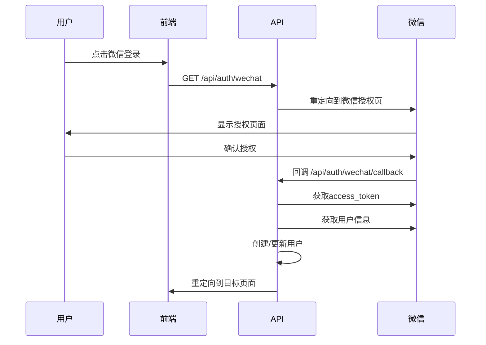
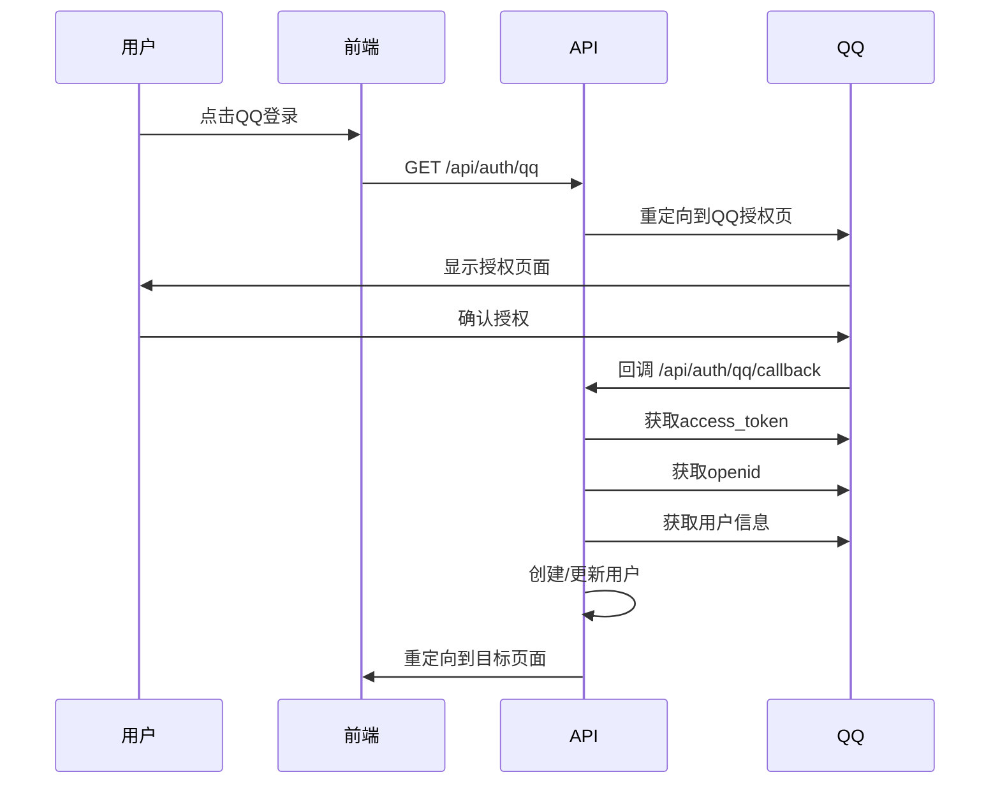

# 社交登录配置指南

本指南将帮助您配置微信登录、QQ登录以及其他社交登录方式。

## 🔧 环境变量配置

在您的 `.env.local` 文件中添加以下配置：

```bash
# ============================================
# 微信开放平台配置
# ============================================
WECHAT_APP_ID=your_wechat_app_id
WECHAT_APP_SECRET=your_wechat_app_secret
WECHAT_REDIRECT_URI=http://localhost:3000/api/auth/wechat/callback

# ============================================
# QQ互联配置
# ============================================
QQ_APP_ID=your_qq_app_id
QQ_APP_KEY=your_qq_app_key
QQ_REDIRECT_URI=http://localhost:3000/api/auth/qq/callback

# ============================================
# Google OAuth配置 (已有)
# ============================================
GOOGLE_CLIENT_ID=your_google_client_id
GOOGLE_CLIENT_SECRET=your_google_client_secret

# ============================================
# Supabase配置 (已有)
# ============================================
NEXT_PUBLIC_SUPABASE_URL=your_supabase_url
NEXT_PUBLIC_SUPABASE_ANON_KEY=your_supabase_anon_key
SUPABASE_SERVICE_ROLE_KEY=your_supabase_service_role_key
```

## 📱 微信开放平台配置

### 1. 注册微信开放平台

1. 访问 [微信开放平台](https://open.weixin.qq.com/)
2. 注册开发者账号并完成企业认证
3. 创建网站应用

### 2. 配置网站应用

1. **应用信息**：
   - 应用名称：QuizMate
   - 应用描述：AI学习伙伴
   - 应用官网：您的域名

2. **授权回调域**：
   - 开发环境：`localhost:3000`
   - 生产环境：`yourdomain.com`

3. **获取配置信息**：
   - `WECHAT_APP_ID`：应用AppID
   - `WECHAT_APP_SECRET`：应用AppSecret

### 3. 微信登录流程



## 🐧 QQ互联配置

### 1. 注册QQ互联

1. 访问 [QQ互联](https://connect.qq.com/)
2. 注册开发者并完成认证
3. 创建网站应用

### 2. 配置网站应用

1. **应用信息**：
   - 网站名称：QuizMate
   - 网站地址：您的域名
   - 备案号：如有

2. **回调地址**：
   - 开发环境：`http://localhost:3000/api/auth/qq/callback`
   - 生产环境：`https://yourdomain.com/api/auth/qq/callback`

3. **获取配置信息**：
   - `QQ_APP_ID`：APP ID
   - `QQ_APP_KEY`：APP KEY

### 3. QQ登录流程



## 📊 数据库配置

### 用户表扩展

确保您的用户表支持社交登录字段：

```sql
-- 添加社交登录字段（如果不存在）
ALTER TABLE users ADD COLUMN IF NOT EXISTS provider VARCHAR(50);
ALTER TABLE users ADD COLUMN IF NOT EXISTS provider_id VARCHAR(255);
ALTER TABLE users ADD COLUMN IF NOT EXISTS avatar_url TEXT;
ALTER TABLE users ADD COLUMN IF NOT EXISTS nickname VARCHAR(255);
ALTER TABLE users ADD COLUMN IF NOT EXISTS user_metadata JSONB;

-- 创建社交登录索引
CREATE INDEX IF NOT EXISTS users_provider_id_idx ON users(provider, provider_id);
```

## 🚀 部署注意事项

### 1. 生产环境配置

- 确保回调URL使用HTTPS
- 更新微信/QQ应用的授权域名
- 设置正确的环境变量

### 2. 域名配置

```bash
# 生产环境回调URL
WECHAT_REDIRECT_URI=https://yourdomain.com/api/auth/wechat/callback
QQ_REDIRECT_URI=https://yourdomain.com/api/auth/qq/callback
```

### 3. 安全注意事项

- 保护好APP_SECRET和APP_KEY
- 使用环境变量，不要硬编码
- 定期更换密钥
- 实施IP白名单（如有需要）

## 🔍 测试指南

### 开发环境测试

1. **微信登录测试**：
   ```bash
   curl http://localhost:3000/api/auth/wechat
   ```

2. **QQ登录测试**：
   ```bash
   curl http://localhost:3000/api/auth/qq
   ```

### 验证登录流程

1. 点击登录按钮
2. 完成授权
3. 检查用户信息是否正确保存
4. 验证会话是否创建成功

## ❗ 常见问题

### Q: 微信登录返回10003错误
A: 检查redirect_uri是否与微信后台配置一致

### Q: QQ登录显示redirect_uri_mismatch
A: 确保QQ互联后台的回调地址与代码中一致

### Q: 演示模式下是否可以测试？
A: 是的，演示模式下会模拟社交登录，无需真实配置

### Q: 如何获取用户头像？
A: 用户信息中包含avatar_url字段，可直接使用

## 📝 更新日志

- **2025-01-01**: 添加微信和QQ登录支持
- **2025-01-01**: 更新认证流程和数据库结构
- **2025-01-01**: 添加演示模式支持

---

## 💡 开发提示

1. **演示模式**：如果未配置真实的社交登录，系统会自动进入演示模式
2. **调试信息**：开发环境下会在控制台输出详细日志
3. **错误处理**：所有错误都会重定向到注册页面并显示错误信息
4. **用户合并**：同一个社交账号再次登录会更新现有用户信息

需要帮助？请查看 [技术文档](./README.md) 或联系开发团队。
